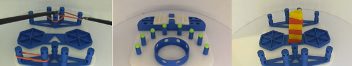
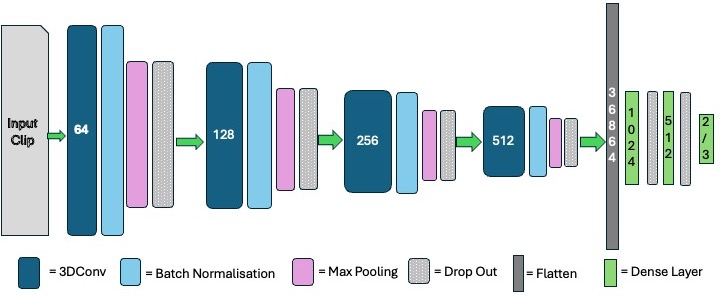
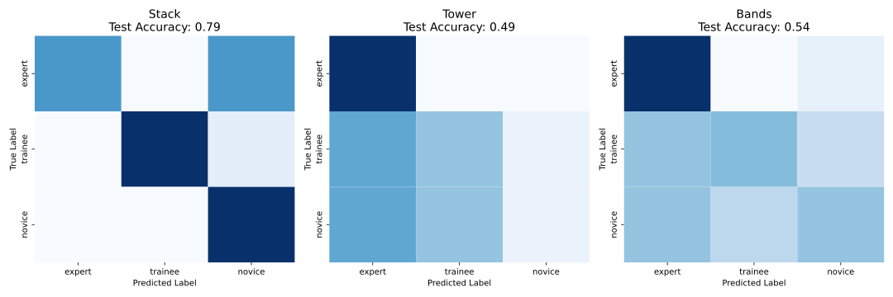
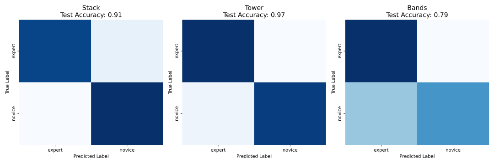
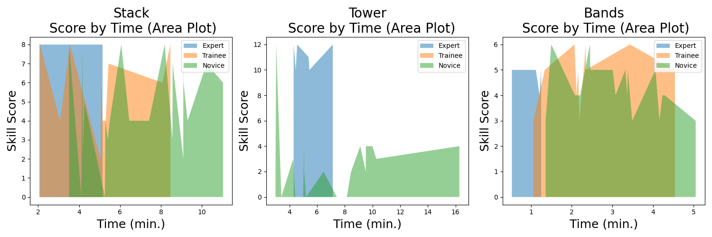
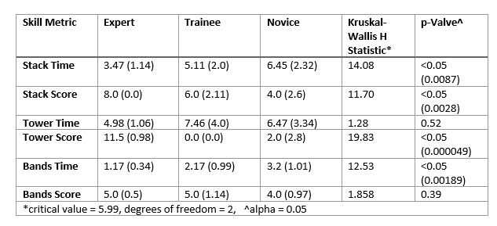

# 🧠 Laparoscopic Skill Assessment using Deep Learning  

  
  
  
  
  
[](https://doi.org/10.1038/s41598-025-96336-5)

Automated assessment of simulated laparoscopic surgical performance using **computer vision and deep learning (3DCNN)**.  

--- 

Automated assessment of simulated laparoscopic surgical performance using computer vision and deep learning (3DCNN). 

📌 Overview

This repository implements a deep learning framework for objective assessment of laparoscopic surgical skill using simulation video data.
The system uses a 3D Convolutional Neural Network (3DCNN) to extract spatiotemporal features and classify operator expertise:

- Novice

- Trainee

- Expert

This work demonstrates how AI can:

- reduce reliance on subjective human assessment

- scale evaluation in simulation-based training

- provide consistent, reproducible performance metrics

---

📄 Associated Publications

Automated Assessment of Simulated Laparoscopic Surgical Performance using 3DCNN. IEEE EMBC (2024)
https://doi.org/10.1109/EMBC53108.2024.10782160.

Automated assessment of simulated laparoscopic surgical skill performance using deep learning. Scientific Reports (Nature Portfolio, 2025)
https://doi.org/10.1038/s41598-025-96336-5

---

🎯 Motivation

Traditional surgical skill assessment:

- relies on expert raters

- is time-intensive

- introduces subjectivity
  
Even structured frameworks (e.g. OSATS) require manual scoring.
This project explores whether deep learning can directly infer skill from video, enabling scalable and objective assessment.

---

🗂 Dataset: LSPD (Laparoscopic Surgical Performance Dataset)
Characteristics

Tasks:

- Bands

- Stack

- Tower



Participants:

- Novice

- Trainee

- Expert

~100 videos expanded to 2244 samples via augmentation

Weak supervision:

- labels applied at video level

⚠️ The dataset used in this study is not publicly available due to ethical, privacy, and institutional governance constraints. 
Access may be considered upon reasonable request to the corresponding author, subject to appropriate approvals and data sharing agreements.

---

🧪 Methodology 

Preprocessing

- Video trimming (OpenCV)

- Frame resizing (128×128)

- Normalisation

- Data augmentation:

  - Gaussian blur

  - Brightness / contrast

  - Salt & pepper noise

  - Horizontal flipping

---

Model Architecture (3DCNN)

- 4 × Conv3D layers (64 → 512 filters)

- Kernel size: 3×3×3

- Batch Normalisation

- Max Pooling (2×2×2)

- Dropout (0.1–0.5)

- Fully connected layers (1024 → 512)
Outputs:

  - Multi-class: novice / trainee / expert

  - Binary: novice vs expert



---

Training

- 5-fold cross-validation

- Train/test split: 80/20

- Validation split: 20% of training

- Optimiser: Adam

- Loss: Binary cross-entropy

---

📊 Results 

Multi-class Classification 

Skill	          Accuracy \
Stack	          79% \
Tower	          49% \
Bands	          54% 



Performance was highest for the stack task, while classification of the trainee group remained challenging due to heterogeneity.	

Binary Classification (Expert vs Novice) 

Skill	          Accuracy \
Stack	          91% \
Tower	          97% \
Bands	          79% 



Binary classification demonstrated strong discrimination between expert and novice participants, particularly for the tower task.



---


	
📈 Statistical Analysis of Task Difficulty

- Stack time: H = 14.08, p = 0.0087

- Stack score: H = 11.70, p = 0.0028

- Tower score: H = 19.83, p = 0.000049

- Bands time: H = 12.53, p = 0.00189 

Not significant:

- Tower time: H = 1.28, p = 0.52

- Bands score: H = 1.858, p = 0.39

 

---

👨‍⚕️ Inter-Rater Reliability

- Stack: κ = 1.00

- Tower: κ = 0.76

- Bands: κ = 0.72

---

👨‍⚕️ Human vs Model Performance

Multi-class agreement:

- Stack: κ = 0.40

- Tower: κ = 0.41

- Bands: κ = 0.12
  
Binary agreement:

- Stack: κ = 0.53

- Tower: κ = 0.90

- Bands: κ = -0.18
  
The model achieved higher and more consistent performance, particularly in binary classification.

---

🔑 Key Insights

- Strong discrimination between expert vs novice

- Tower task provides the clearest separation

- Trainee group remains difficult to classify

- Human agreement varies significantly

- AI enables consistent, scalable evaluation

---

🖼 Visual Overview
System Pipeline \
Raw Video → Preprocessing → 3DCNN → Feature Extraction → Classification → Metrics \
Model vs Human \
Human: variable, subjective \
Model: consistent, reproducible \
Task Difficulty:  
- Tower → Strong 
- Stack → Moderate 
- Bands → Weak

  

---

📊 Example Output \
{ \
"task": "tower", \
"prediction": "expert", \
"confidence": 0.94 \
}

---

🧱 Repository Structure
src/
-  config.py
-  data.py
-  model.py
-  train.py
-  evaluate.py
-  utils.py
  
notebooks/
-  auto_skills_assess.ipynb

---
  
🚀 Quick Start

Install dependencies: 
- pip install -r requirements.txt

Train model:
- python src/train.py

Evaluate model:
- python src/evaluate.py

---

💡 Key Contributions

- LSPD dataset for laparoscopic skill assessment

- 3DCNN-based spatiotemporal modelling

- Weakly supervised learning

- Scalable AI-driven evaluation

---

⚠️ Limitations

- Small dataset

- Trainee variability

- No frame-level labels

- Simulation-only data

---

🔮 Future Work

- Attention-based video models

- Multi-modal inputs

- Real-world deployment

- Integration into simulation systems

---

📜 License

MIT License

---

👤 Author 

David Power \
AI | Healthcare Simulation | Medical Education \
University College Cork, Ireland

---

## 📚 Citation  

If you use this code or build upon this work, please cite:  


```bibtex
@article{power2025laparoscopic,
  title   = {Automated assessment of simulated laparoscopic surgical skill performance using deep learning},
  author  = {Power, David and Burke, C. and Madden, Michael G. and others},
  journal = {Scientific Reports},
  volume  = {15},
  pages   = {13591},
  year    = {2025},
  doi     = {10.1038/s41598-025-96336-5},
  publisher = {Nature Publishing Group}
}


@inproceedings{power2024laparoscopic,
  title     = {Automated Assessment of Simulated Laparoscopic Surgical Performance using 3DCNN},
  author    = {Power, D. and Ullah, I.},
  booktitle = {2024 46th Annual International Conference of the IEEE Engineering in Medicine and Biology Society (EMBC)},
  address   = {Orlando, FL, USA},
  pages     = {1--4},
  year      = {2024},
  doi       = {10.1109/EMBC53108.2024.10782160},
  publisher = {IEEE}
}

